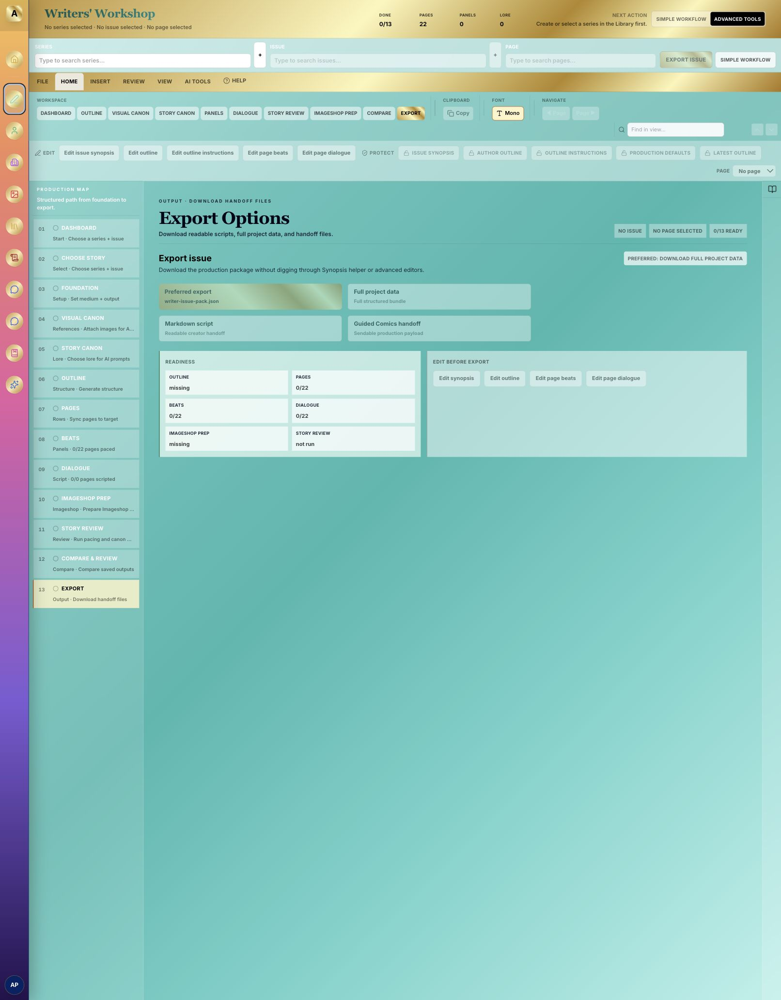
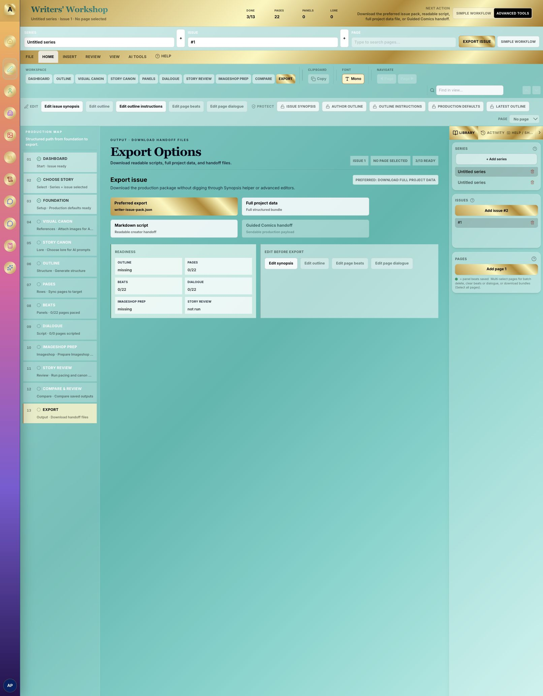
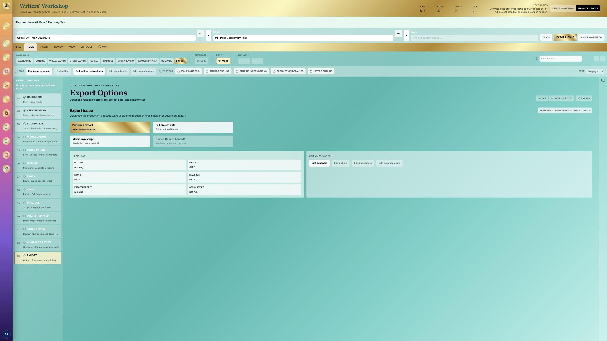
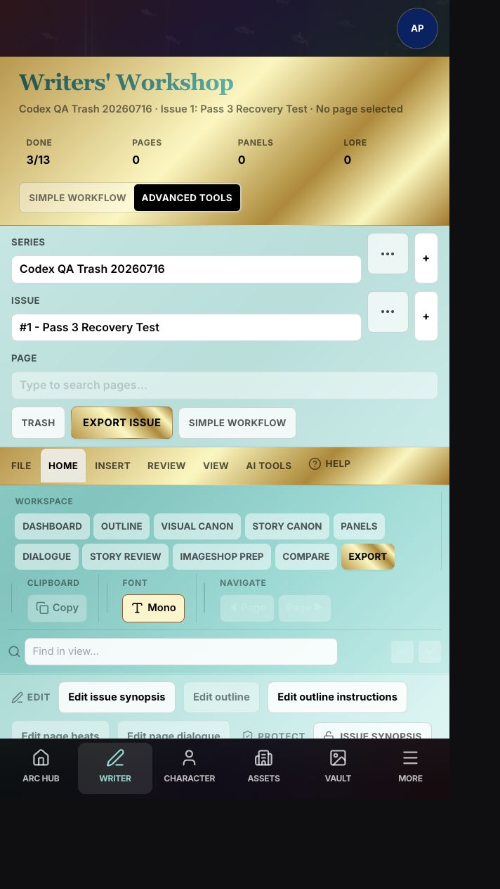
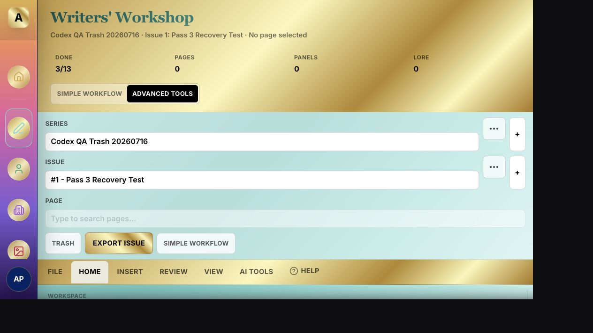

# Writers' Workshop User-Facing Feature Completeness Audit - 2026-07-16

## Audit scope

This audit applies the project's User-Facing Feature Completeness Standard to the redesigned Writers' Workshop. It covers the signed-in local workflow, all 13 production stages, series/issue management, recovery, keyboard and assistive-technology behavior, responsive behavior, persistence, and cross-portal deletion paths.

The visual baseline was captured from the signed-in demo account at `http://127.0.0.1:5174/`. The production tab was retained for final post-deploy comparison; no live changes were made during this audit.

## Evidence

### Step 1 - Empty dashboard - needs work

- The dashboard gives a clear next action and disables issue/page actions until prerequisites exist.
- The global page count still shows `22` with no selected series or issue, which makes the empty state misleading.
- The empty state exposes creation but not Trash, restore, or any explanation of where existing records can be managed.

### Step 2 - Series and issue selected - needs work

- Add/select actions work and the advanced Library displays the selected records.
- Creating a blank series and issue immediately advances the workflow to `3/13 ready`, although no story context, outline, pages, or review work exists.
- Series and issue deletion is exposed only as small advanced-dock trash icons and is permanent. Rename is available only indirectly through Story Context fields.
- The default Simple Workflow does not expose rename, Trash, restore, or a target-aware context menu.

## Strengths to preserve

- The redesigned shell has a clear primary production area, compact tool zones, and a visible next-action summary.
- The Help modal has focus entry, focus trapping, Escape dismissal, and focus restoration.
- Ribbon tabs use tab semantics and roving keyboard focus.
- Search menus already support Arrow keys, Enter, and Escape visually.
- Focused mode and responsive phone/tablet layouts already provide a workable structural foundation.
- Existing update APIs can rename series and issues without a schema change.

## Highest-impact risks

1. **Record management is hidden.** Simple Workflow is the default, but only Advanced Tools exposes tiny destructive icons. Users cannot reasonably discover rename, Trash, or restore.
2. **Deletion is permanent and cascades broadly.** Deleting a series removes issues, pages, outlines, beats, dialogue, lore, and related records. Guided Comics provides a second permanent-delete path.
3. **Workspace restoration is unreliable.** The selected-series loading effect clears the saved issue before validating it, so issue/page restoration can fail after reload.
4. **Workflow completion is overstated.** Selecting a series counts Foundation complete; Compare & Review has no completion criterion. The progress denominator therefore does not reliably describe completed work.
5. **Async feedback is often invisible.** Many creates, saves, deletes, AI runs, and exports write only to the hidden Activity log and do not announce success or failure.
6. **Custom combobox semantics are incomplete.** The popup lacks listbox wiring, `aria-controls`, and `aria-activedescendant`.
7. **Contrast and target-size risks remain.** Several 7-10px labels use low-opacity black over Tiffany/gold surfaces; destructive controls are 24px square.
8. **Responsive reachability is unverified.** Fixed-height stage panels and a 42vh phone dock can create nested scrolling on short landscape screens.

## Completeness matrix

| Stage | Existing primary path | Missing or incomplete surface | Planned acceptance condition |
| --- | --- | --- | --- |
| 1. Dashboard | Create/open story, progress, next action | Manage, Trash, accurate selected-scope metrics | Selected-scope metrics and obvious manage/restore entry |
| 2. Choose Story | Select/add series and issue | Rename, Trash, restore, target-aware context actions | Visible `More` actions plus equivalent row context actions |
| 3. Foundation | Story context fields and save | Accurate completion, explicit success state | Completion reflects saved/reviewed defaults; save is announced |
| 4. Visual Canon | Open, attach, refresh, help | Complete loading/permission/empty feedback | Every unavailable action explains why and how to recover |
| 5. Story Canon | Lore CRUD and AI checks | Manual empty-state entry, live success/error | Manual add is obvious; AI and CRUD results are announced |
| 6. Outline | Generate, edit, download | Focused prerequisite explanation | Disabled generation identifies missing issue/context |
| 7. Pages | Sync/create and select | Focused empty explanation, recoverable removal | Empty state is actionable; destructive page behavior is explicit |
| 8. Beats | Generate, preview, download/clear/send | Focused direct edit and recovery clarity | Edit path is visible; clear/regenerate scope and recovery are clear |
| 9. Dialogue | Generate/style/download/clear | Focused edit and prerequisite explanation | Direct edit is visible and disabled actions explain dependencies |
| 10. Imageshop Prep | Prepare/send/open branches | Guard unready branch actions | Unready branches provide remediation instead of silent navigation |
| 11. Story Review | Run reviews and show readiness | Empty-series state and announcements | No-selection state is actionable; results/errors are announced |
| 12. Compare & Review | Compare saved outputs | Completion criterion | A concrete comparison action determines completion |
| 13. Export | Preferred and format-specific downloads | Format prerequisites and success feedback | Disabled formats explain requirements; downloads are acknowledged |

## Approved Recoverable Trash contract

- Add nullable `deleted_at` to `writer_series` and `writer_issues`.
- Active list queries exclude trashed rows; Trash queries include only trashed rows.
- Moving a series to Trash hides the series but keeps its issues, pages, outlines, lore, and generated work intact.
- Restoring a series reveals its non-trashed issues. Issues independently moved to Trash remain in Trash.
- Restoring an issue preserves its existing issue number and children.
- New issue numbering accounts for active and trashed issues so the existing uniqueness constraint cannot collide.
- No permanent-delete control is added to the user interface. Permanent deletion remains a manual operator/database task.
- The same Trash behavior replaces Guided Comics' Writer-issue hard-delete path.
- Writer AI tools reject stale identifiers for trashed issues or series.
- An immediate Undo action and a persistent Trash panel provide both short- and long-term recovery.

## Accessibility and responsive acceptance targets

- Search menus expose a stable listbox relationship, active option, keyboard behavior, and no-results announcement.
- Visible overflow controls have descriptive names, support click, Context Menu/Shift+F10 on targetable rows, Escape, and focus restoration.
- Current workspace/series/issue/page selection is exposed consistently.
- Mutations use polite success/progress announcements and alert semantics for actionable failures.
- Important copy meets contrast requirements without changing the established palette or gradients.
- Mobile actions use adequate target sizes; reduced-motion preferences suppress nonessential motion.
- At `320x568`, `568x320`, `768x1024`, and `1280x720`, the Writer workspace has no document-level horizontal overflow and primary actions remain reachable.

## Verification plan

- API tests: active/trash filters, trash, restore, next issue number, and error behavior.
- Component tests: rename validation, Trash confirmation, Undo, persistent restore, keyboard/context access, focus restoration, live regions, and selection semantics.
- Persistence tests: valid series/issue/page selection restores; missing or trashed selection clears; series switching clears the prior issue.
- Cross-portal tests: Guided Comics moves Writer issues to Trash.
- Stage smoke: each of the 13 stages exposes either an enabled primary action or an actionable prerequisite message.
- Final regression: focused suites, full tests, build, lint, diff check, desktop/tablet/phone browser QA, deploy, and signed-in live smoke.

## Evidence limits

- Screenshot review can identify hierarchy, contrast, density, and visible affordances, but it cannot prove screen-reader behavior or WCAG compliance. Those items require DOM, keyboard, responsive, and automated checks.
- The initial audit intentionally did not execute every destructive or AI action. Disposable create/rename/Trash/restore/export coverage is part of the implementation QA passes.

## Pass 1 result

Passed. The signed-in local environment was restored on strict port `5174`, empty and selected-record baselines were captured and inspected, and three independent code audits produced consistent findings.

## Pass 2 result

Passed. The completeness matrix, Recoverable Trash behavior, accessibility targets, test strategy, rollback constraint, and cross-portal scope are explicit enough to implement without additional product decisions.

### Step 3 - Recoverable story management - passed

- Series and issue rows now expose named `More actions` menus with Rename and Move to Trash.
- Destructive actions use an in-app recoverable-action confirmation that explains exactly which saved work remains intact.
- Immediate Undo and the persistent Trash panel both restored the disposable issue and reselected it with its original issue number.
- Reload restored the selected series and issue after the prior issue-selection race was removed.
- Guided Comics now uses the same recoverable issue behavior, and Writer Tools rejects trashed series or issue identifiers.

## Pass 3 result

Passed. The signed-in demo workflow created and renamed a disposable series and issue, moved the issue to Trash, restored it first through Undo and then through the persistent Trash panel, and confirmed the selected workspace survives reload. The database migration was applied before the UI used `deleted_at`.

## Audit 1 result

Passed. Three focused suites completed with 33 passing tests, the production build completed, the Edge Function type check completed, the Trash schema was verified through the linked Supabase REST endpoint, and signed-in browser QA confirmed both short-term and persistent recovery paths. The known `22`-page empty/selected metric and overstated workflow completion remain intentionally assigned to Pass 4.

## Pass 4 result

Passed. Selected-scope header metrics now report the active issue's actual page count instead of the global target; a blank issue reports `0`. Foundation requires saved production defaults, and Compare & Review requires an explicit, persisted `Mark review complete` action instead of counting selection alone. Focused Outline, Pages, Beats, Dialogue, Imageshop Prep, Story Review, and Export states now expose prerequisite or remediation copy at the point of use, with direct Beats and Dialogue edit paths and per-format Export requirements.

### Verification

- `npm run test -- --run src/portals/writer/__tests__/writerWorkflowChronology.test.ts src/portals/writer/__tests__/writerProductionDefaults.test.ts src/portals/writer/__tests__/WriterRecordManagement.test.tsx` — 3 files, 14 tests passed.
- `npm run build` — passed; the existing large-chunk warning remains nonblocking.
- `git diff --check` — passed.
- Signed-in browser smoke — blank selected issue showed `Pages 0` and `Done 2/13`; marking comparison reviewed changed progress to `3/13`, and the completion survived leaving and reopening Writers' Workshop.

## Pass 5 result

Passed. Record-management and production mutations now provide visible progress, success, informational, and failure feedback without requiring the hidden Activity panel. Restoring a saved workspace no longer clears a valid issue selection before it can be validated. Simple Workflow now exposes Foundation defaults, an actionable Visual Canon empty state, manual Story Canon entry, and direct empty-page Beats and Dialogue editing. Preferred exports explain unmet requirements instead of presenting an unexplained disabled action.

## Pass 6 result

Passed. Search menus expose combobox/listbox relationships and active options; record action menus support Arrow Up/Down, Home, End, Escape, Context Menu, and Shift+F10 access with focus restoration. Dialogs trap focus, important controls meet the mobile touch-target floor, and reduced-motion behavior is present. Responsive signed-in checks at `320x568`, `568x320`, `768x1024`, and `1280x720` found no document-level horizontal overflow and kept primary actions reachable.

### Step 4 - Responsive phone - passed

- The workflow rail remains reachable without document-level horizontal scrolling.
- Primary stage actions and the fixed phone navigation remain available at `320x568`.

### Step 5 - Responsive short landscape - passed

- The compact stage workspace remains usable at `568x320`.
- Primary controls remain reachable without a document-level horizontal scrollbar.

## Midpoint audit result

Passed after repair. The audit identified five material gaps and they were corrected before functional QA continued:

- cancelled or failed actions could be labeled `Completed`; feedback classification now recognizes explicit error and informational outcomes;
- record-management success could be announced twice; history recording can now suppress the duplicate banner;
- Edit Beats and Edit Dialogue were unavailable for an empty selected page; direct manual editing now depends only on having a selected page;
- record action menus lacked full Arrow/Home/End and row-context behavior; the menu and target rows now expose those paths;
- several compact controls missed the touch-target floor; their interactive areas were increased without changing the established visual palette.

Scoped midpoint verification completed with 4 files / 17 tests passing, a successful production build, and a clean `git diff --check`. The existing large-chunk build warning remained nonblocking.

## Pass 7 result

Passed for the available signed-in demo data. One disposable issue was carried through the complete 22-page production workflow:

- saved Foundation defaults and one Story Canon lore card;
- generated and saved Outline v1;
- synchronized all 22 pages;
- manually saved beats on the initially empty first page, then completed all 22 pages through five batch-generation rounds;
- generated first-page dialogue and a shot plan;
- opened the Writer issue in Imageshop with the correct issue context;
- ran pacing and canon reviews and retained the explicit Compare & Review completion state;
- exercised the Export stage and saved five non-empty artifacts under `/private/tmp/arcs-writers-workshop-qa-20260716`:
  - `writer-issue-pack.json` (97,044 bytes)
  - `writer-issue-pack.md` (32,782 bytes)
  - `writer-guided-comics-handoff.json` (52,942 bytes)
  - `writer-outline-v1.txt` (5,621 bytes)
  - `writer-shot-plan-v1.csv` (14,193 bytes)

Cleanup also passed: all three disposable QA series were moved to Recoverable Trash, leaving their issues and generated children available for manual restoration or later operator deletion.

### Pass 7 evidence limits

- The demo account had no Character Vault or Asset Vault images. Visual Canon's actionable empty state and Refresh paths were exercised, but attaching an existing vault image could not be tested end to end with the available account data. Existing automated visual-reference coverage remains the verification path for that branch until the demo account has a vault image.
- A planned sixth full-workflow screenshot was not captured. Repeated in-app screenshot requests timed out, so no `06-full-workflow-pass.png` is claimed or referenced as evidence.
- Pass 8 regression/documentation closeout and Pass 9 full regression, final audits, deployment, and signed-in live verification remain pending.

## Pass 8 result

Passed. Regression coverage now protects recoverable record management, Trash/restore API behavior, Guided Comics compatibility, keyboard-accessible menus, search semantics, and corrected stage chronology. The focused UX guide documents Rename, Recoverable Trash, Undo/Restore, Foundation defaults, Visual Canon recovery, manual empty-page editing, completion rules, and QA cleanup. Demo credentials remain outside repository documentation.

### Verification

- Scoped release suite: 6 files / 52 tests passed.
- Full regression: 91 files / 474 tests passed.
- `npm run lint` — passed with 0 errors; 69 pre-existing warnings remain outside this feature scope.
- `npm run build` — passed; the existing large-chunk warning remains nonblocking.
- `git diff --check` — passed.

## Final ReAct, QA, and UI/UX audit

Passed after repair for local release readiness.

- **ReAct:** Every blocker was observed before action, repaired in scope, and re-verified before the next pass. The repeated browser-download event timeout was isolated to bridge reporting after all five real files appeared in Downloads; their sizes and structures were validated from disk. The screenshot service timeout is recorded as an evidence limitation rather than a product failure.
- **QA:** The full automated suite passed at 91 files / 474 tests. After the final UI repairs, the focused Writer suite passed at 4 files / 23 tests, the production build passed, and `git diff --check` remained clean.
- **UI/UX:** The final critic found two release issues. Advanced Export formats now expose visible, described prerequisites, and compact/short viewports hide the dense Advanced selectors/ribbon/protection strip while exposing the horizontal stage rail. Browser recheck at an effective `537x358` confirmed no document-level horizontal overflow, the stage rail visible, the ribbon hidden, and the active Story Canon workspace visible.

### Deferred, nonblocking follow-ups

- Story Canon card deletion remains a permanent, separately confirmed action; the approved Recoverable Trash contract covers series and issues only. Consider recoverable lore-card deletion in a future safety pass.
- Increase the size/contrast of the smallest optional metadata labels while preserving the established palette.
- Rename or simplify the static `Export History` information panel unless real session history is added.
- Re-run Visual Canon attachment browser QA after the demo account has a disposable Character or Asset Vault image.

Deployment and signed-in live smoke remain the final Pass 9 gate.
