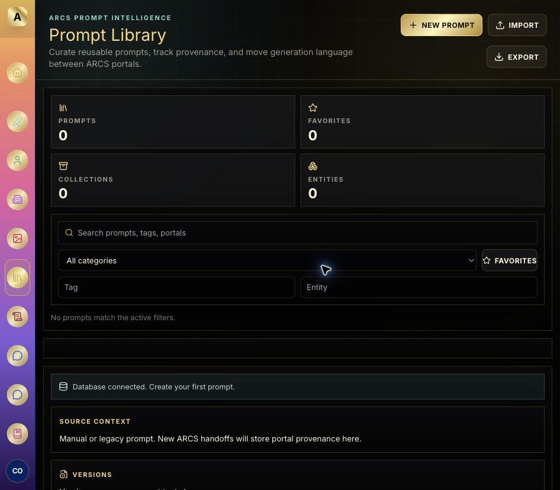
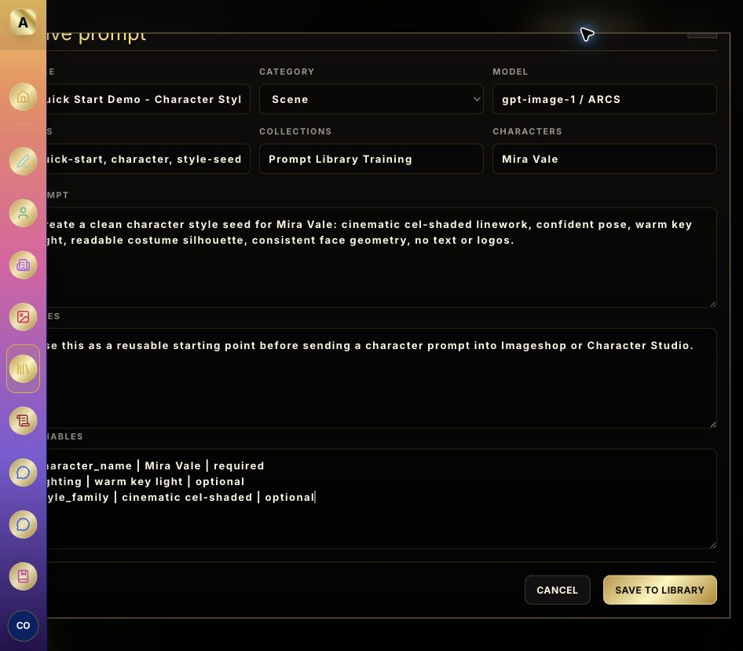
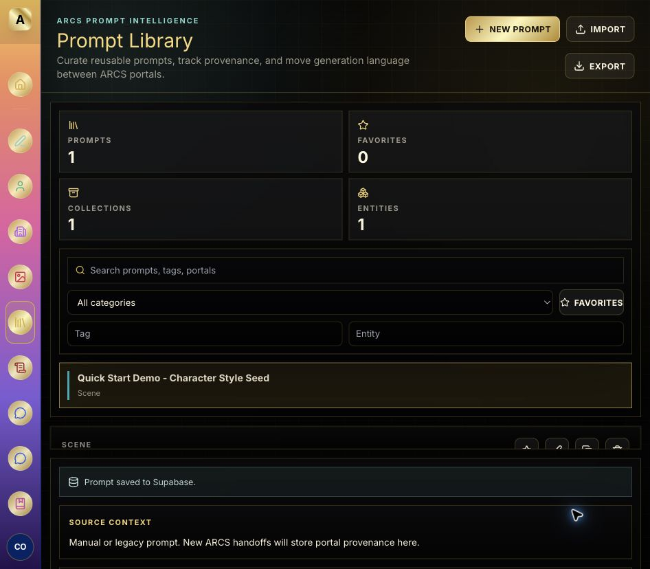
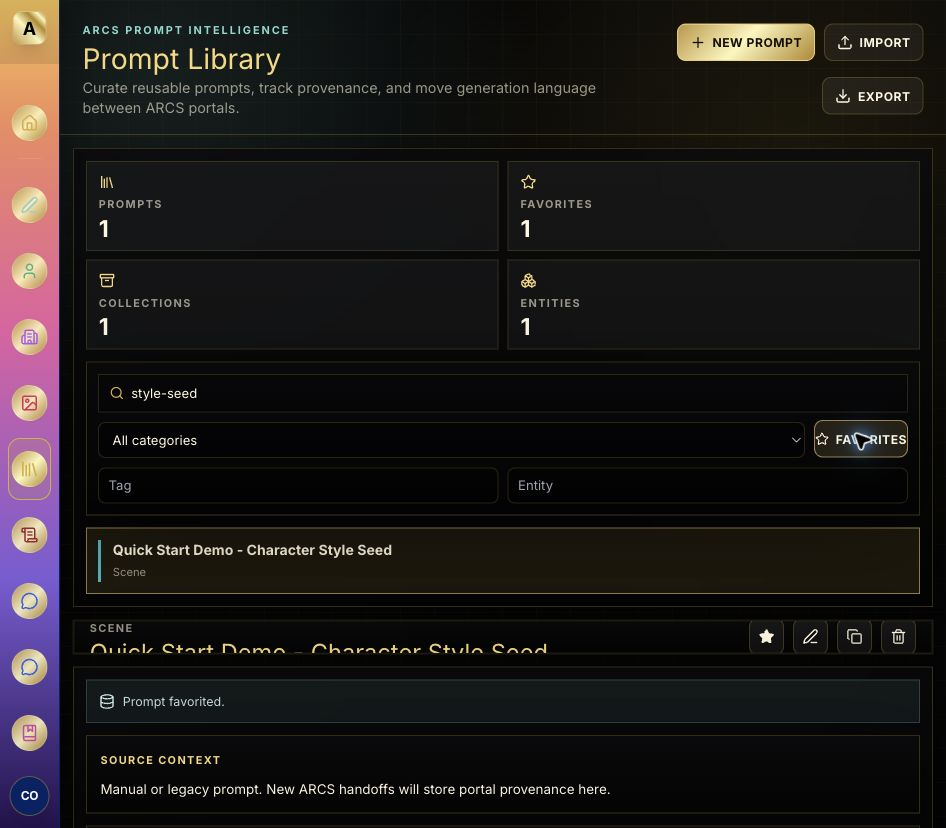
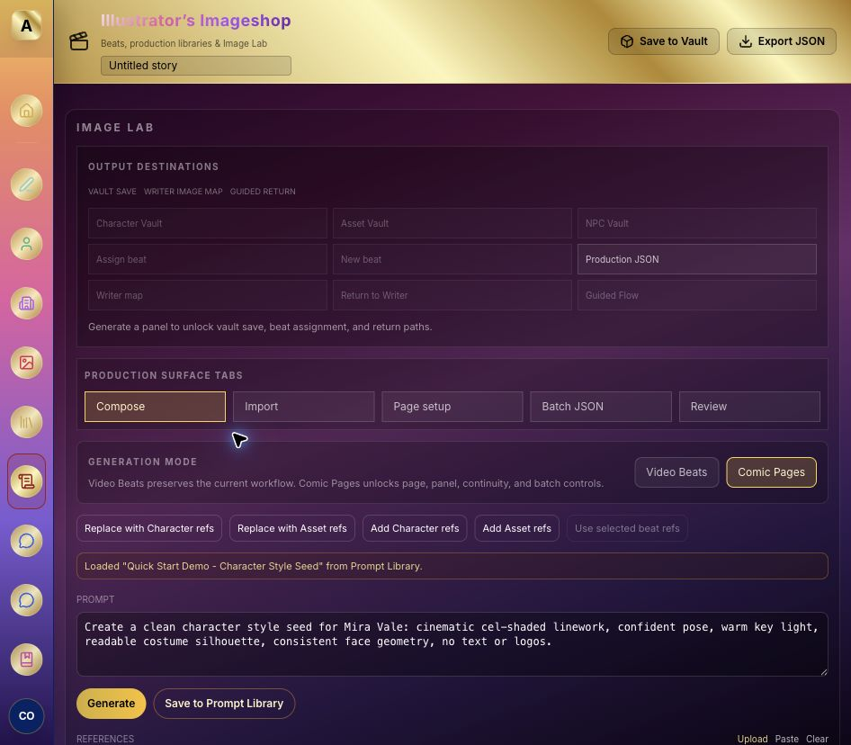
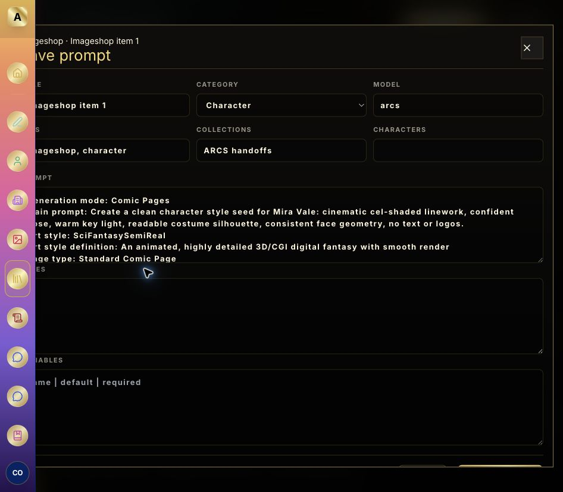

# ARCS Prompt Library Quick Start Guide

Last updated: 2026-06-09

This guide walks through the native ARCS Prompt Library: what it does, how to create and find prompts, how to move prompts into other portals, and how to keep the library useful as it grows.

The screenshots below were captured from the live Cloudflare deployment while signed in as the ARCS agent account. The temporary demo prompt used for screenshots was deleted after capture.

## What the Prompt Library is for

Use the Prompt Library as the shared memory layer for reusable generation language. It is best for prompts you expect to reuse, refine, hand off between portals, or trace back to their source.

Good candidates:

- Character seeds and consistency prompts.
- Scene setup prompts.
- Look and costume prompts.
- Style recipes.
- System or project rules.
- Prompts produced inside Imageshop, Character Studio, Asset Studio, Writer, or Guided Comic flows that you want to preserve.

Avoid saving every one-off scratch prompt. Save prompts that have a name, reuse value, provenance value, or a clear role in a project.

## 1. Open the Prompt Library

Use the left navigation rail and choose **Prompt Library**. When signed in, the library syncs with Supabase. The status panel will say either `Database connected. Create your first prompt.`, `Database library synced.`, or another current sync message.

Key areas:

- **New Prompt**: opens the editor for a manual prompt.
- **Import**: loads a JSON prompt export into the session.
- **Export**: downloads the current prompt library as JSON.
- **Stats**: prompt count, favorites, collections, and linked entities.
- **Search and filters**: find prompts by title, text, tags, source portal, category, entity, or favorite state.
- **Prompt list**: matching prompts appear here.
- **Detail pane**: selected prompt text, action buttons, and metadata.
- **Source Context**: provenance for portal handoffs.
- **Versions**: prompt text history when a prompt is edited.

## 2. Create a reusable prompt

Click **New Prompt** and fill the editor.

Recommended fields:

- **Title**: make it readable in a list, for example `Kron temple reveal` or `Mira style seed`.
- **Category**: choose the closest type: Character, Look, Scene, Style, System, Project, or Misc.
- **Model**: note the intended target, such as `gpt-image-1`, `arcs`, or a portal-specific model note.
- **Tags**: use short lowercase tags. Example: `kron, temple, reveal, continuity`.
- **Collections**: group prompts by project, issue, episode, client, or workflow.
- **Characters**: add character names when the prompt should count toward entity discovery.
- **Prompt**: put the reusable generation language here.
- **Notes**: explain when to use the prompt, what it depends on, or what not to change.
- **Variables**: use one per line in the format `name | default | required`.

Practical recommendation: write prompt titles like file names for humans. A good title should tell you what the prompt does without opening it.

## 3. Save and review the prompt

Click **Save to Library**. In production, a successful save shows `Prompt saved to Supabase.` and the prompt appears in the list.

Use the detail pane for everyday work:

- **Star**: mark high-value prompts as favorites.
- **Edit**: revise the selected prompt. Text changes create version history.
- **Duplicate**: use an existing prompt as a starting point.
- **Delete**: remove the selected prompt.
- **Copy**: copy the raw prompt text to the clipboard.
- **Use in Imageshop / Character Studio / Asset Studio**: send the prompt into another ARCS portal.

Versioning tip: when you refine a prompt, keep the title stable unless the prompt has become a different reusable asset. Version history is most useful when edits represent the evolution of the same idea.

## 4. Search, filter, and favorite

Use search for broad lookup and the smaller filters for tighter retrieval.

Search can find:

- Prompt titles.
- Prompt body text.
- Tags.
- Portal/source labels.

Filters are best for:

- **Category**: narrowing to Character, Scene, Style, etc.
- **Favorites**: showing only trusted or frequently reused prompts.
- **Tag**: finding a specific production concept.
- **Entity**: finding prompts tied to a character, look, or scene.

Recommendation: use tags for workflow traits and entities for story/world objects. For example, `continuity`, `lighting`, and `style-seed` are tags; `Kron`, `Mira Vale`, and `Temple Interior` are entities.

## 5. Send a prompt to Imageshop

Open a saved prompt and click **Use in Imageshop**. ARCS switches to Illustrator's Imageshop and loads the prompt into the Image Lab compose area.

What to check after the handoff:

- The status line says the prompt was loaded from Prompt Library.
- The prompt text appears in the Imageshop prompt box.
- The composed generation prompt includes the library text plus Imageshop page/style/continuity settings.
- You can still adjust Imageshop-specific controls before generating.

Tip: treat the Prompt Library prompt as the reusable core, then use Imageshop controls for the shot-specific or page-specific details.

## 6. Save a portal prompt back to the library

From Imageshop, click **Save to Prompt Library**. ARCS opens the Prompt Library editor with source provenance already attached.

This reverse-save flow is useful when:

- You built a strong prompt inside Imageshop and want to reuse it.
- A portal added valuable context, such as page setup or continuity rules.
- You want future agents or users to know where a prompt came from.

Before saving, improve the title. Portal-generated titles like `Imageshop item 1` are useful as provenance but not as library names. Rename them to something you can find later, such as `Mira style seed with page continuity`.

## 7. Import and export

Use **Export** before major cleanup or migration work. The export downloads `arcs-prompt-library-export.json`.

Use **Import** when you want to load a JSON prompt set into the session. Imported prompts should be reviewed and saved individually if you want curated database persistence.

Recommendation: export before deleting batches of prompts or restructuring collections. It gives you a recovery point without preserving old clutter in the active library.

## Suggested library habits

- Keep prompts reusable. If a prompt only made sense for one generation, do not save it unless it records an important source handoff.
- Name prompts by purpose, not by date.
- Use collections for projects and issues.
- Use tags for retrieval traits.
- Use entities for characters, scenes, looks, and recurring world objects.
- Favorite only prompts you would confidently reuse.
- Edit prompts when improving the same asset; duplicate when branching into a new purpose.
- After portal source-save, rename the title before saving.
- Keep notes short but operational: when to use it, what to preserve, and what to avoid.

## Troubleshooting

- If the library shows demo prompts, sign in before relying on persistence.
- If a save appears slow, wait for the status panel to finish syncing before refreshing.
- If a prompt does not appear after saving, clear active search/favorite/tag/entity filters.
- If a handoff lands in the wrong portal, return to Prompt Library and try the explicit target button again.
- If the source context panel says manual or legacy prompt, the prompt was created manually or came from an older path without portal provenance.

## Fast path checklist

1. Open **Prompt Library**.
2. Click **New Prompt**.
3. Add title, category, tags, collection, entities, prompt text, and notes.
4. Click **Save to Library**.
5. Star it if it is reusable.
6. Use search or filters to find it later.
7. Click **Use in Imageshop**, **Character Studio**, or **Asset Studio** when you want to work with it.
8. From a portal, use **Save to Prompt Library** when a generated or composed prompt becomes worth preserving.
